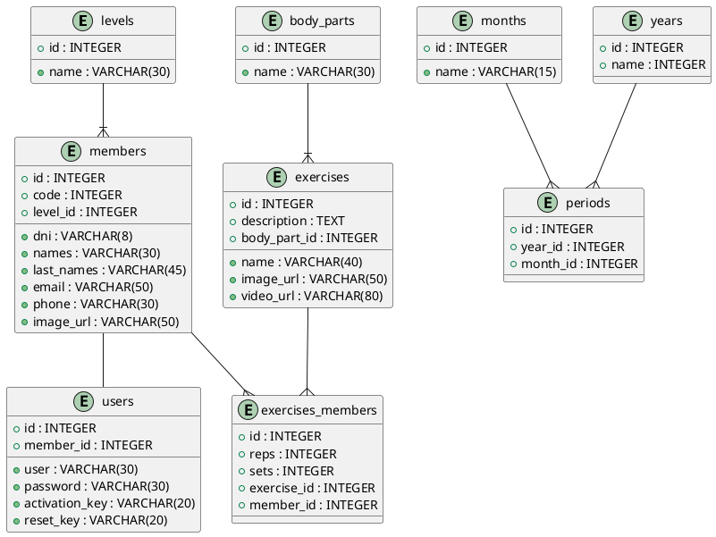

## Base de Datos

Instalar y activar el ambiente virtual - Linux:

    $ sudo apt install python3-virtualenv python3-venv
    $ python3 -m venv ./env
    $ source env/bin/activate

Instalar y activar el ambiente virtual - Windows:

    > pip install virtualenv
    > virtualenv env
    > env\Scripts\activate.bat

Arrancar aplicación:

    $ cd <<carpeta-proyecto>>
    $ pip install -r requirements.txt
    $ mkdir static/uploads
    $ python main.py

## Migraciones

Archivo <b>.env</b>

    DB=sqlite:db/app.db
    SQALCHEMY_CONNECTION_STRING=sqlite:///db/app.db
    ENV=local||replit
    OPENAI_API_KEY=xyz
    EMAIL_SENDER=correo@correo.com
    EMAIL_PASSWORD=123

Migraciones con DBMATE - app:

    $ dbmate -d "db/migrations" -e "DB" new <<nombre_de_migracion>>
    $ dbmate -d "db/migrations" -e "DB" up
    $ dbmate -d "db/migrations" -e "DB" rollback

Backup SQLite

    $ sqlite3 app.db .dump > dbname.bak

Ubuntu ruby sequel con sqlite3

    $ sudo apt install ruby-dev
    $ sudo apt install libsqlite3-dev

Ejecutar la aplicación desde <b>config.ru</b>:

    $ rackup

Tareas de <b>Rakefile</b>

    $ rake {task name}

Ejecutar con rerun:

    $ rake dev:start

Sinatra Boilerplate PP:

    https://github.com/pepeul1191/sinatra-boilerplate-4

React PP:

    https://github.com/pepeul1191/react-rollup

MongoDB:

    $ sudo chown -R mongodb:mongodb /var/lib/mongodb
    $ sudo chown mongodb:mongodb /tmp/mongodb-27017.sock
    $ sudo chown -R mongodb:mongodb /var/log/mongodb
    $ sudo systemctl start mongod
    $ sudo ss -pnltu | grep 27017
    $ mongosh

Consultas MongoDB:

Fetch all a un resumen de todas las conversaciones:

```javascript
db.conversations.aggregate([
  {
    "$project": {
      "_id": { "$toString": "$_id" },
      "name": 1,
      "created_at": 1,
      "updated_at": 1,
      "num_messages": { "$size": "$messages" }
    }
  }
])
```

Fetch a una conversación:

```javascript
db.conversations.aggregate([
  {
    "$match": {
      "_id": ObjectId("6657a01ca322c35b1401b1f9")
    }
  },
  {
    "$project": {
      "_id": { "$toString": "$_id" },
      "name": 1,
      "created_at": 1,
      "updated_at": 1,
      "messages": {
        "$map": {
          "input": "$messages",
          "as": "message",
          "in": {
            "_id": { "$toString": "$$message._id" },
            "content": "$$message.content",
            "question": "$$message.question",
            "error": "$$message.error",
            "created_at": "$$message.created_at",
            "answer": {
              "_id": { "$toString": "$$message.answer._id" },
              "columns": "$$message.answer.columns",
              "result_set": "$$message.answer.result_set"
            }
          }
        }
      }
    }
  }
]);
```

Diagrama de Base de Datos Relacional



Preguntas de ejemplo:

+ lista de miembros
+ nombres de ejercisios y cantidad de ejercicios asignados a cuantos miembros agrupados por ejercicio

---

Fuentes:

+ https://chat.openai.com/c/605a221a-87d7-4798-8783-37ecd465e384
+ https://github.com/sulmanweb/openai_chatgpt
+ https://www.cherryservers.com/blog/install-mongodb-ubuntu-22-04
+ https://regex101.com/r/rbf4KT/1